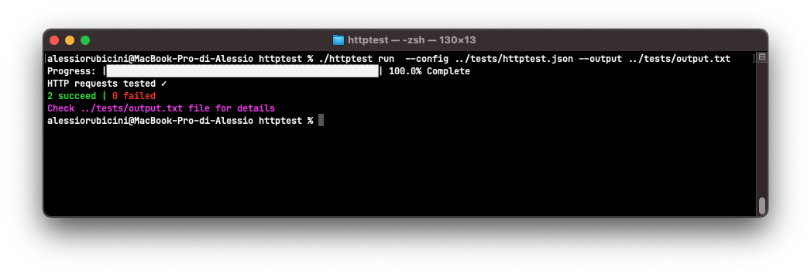

<h1>httptest</h1>

>*httptest* is a Python command-line tool that automates HTTP requests for testing web APIs inside softwares, like unit testing!

	

For documentation check the [documentation.md](documentation.md) file

# Table of contents

- [Installation](#installation)
- [License](#license)
	- [Authors/Copyright](#authors--copyright)
	- [License details](#license-details)

# Installation

# License

## Authors/Copyright

Copyright 2021 (c) Alessio Rubicini.

Please check the AUTHORS file for extended reference

## License details

The licence for this repository is a MIT license. Please see the LICENSE file for full reference.
